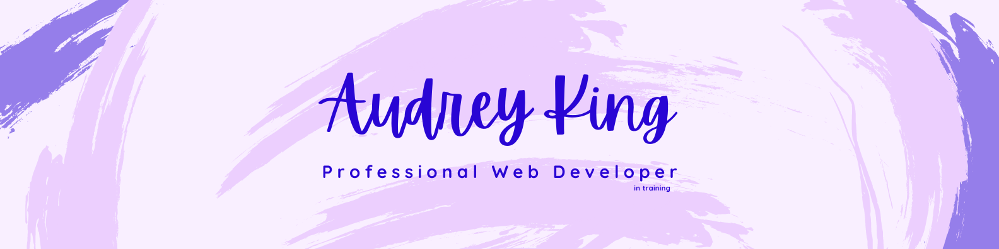

<h1 align="center">Hi 👋, I'm Audrey</h1>
<h3 align="center">A passionate full stack web development student</h3>

- 🔭 I’m currently working on [my portfolio](https://audreymking.github.io/Audrey-King-Portfolio/)

- 🌱 I’m currently learning **Node.js**

- 👨‍💻 All of my projects are available at [https://github.com/audreymking](https://github.com/audreymking)

- 📫 How to reach me **audreymking1@gmail.com**

- ⚡ Fun fact **I love to make amigurumi**

<h3 align="left">Connect with me:</h3>

<h3 align="left">Languages and Tools:</h3>

      

